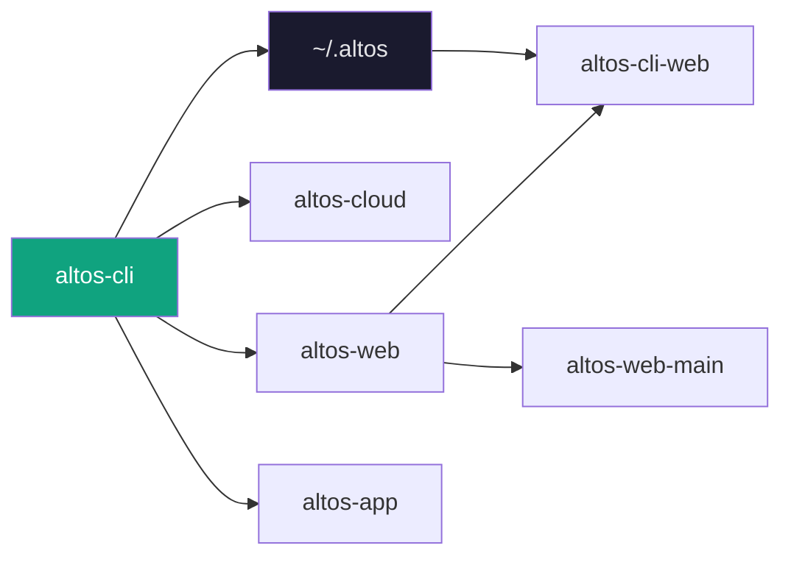
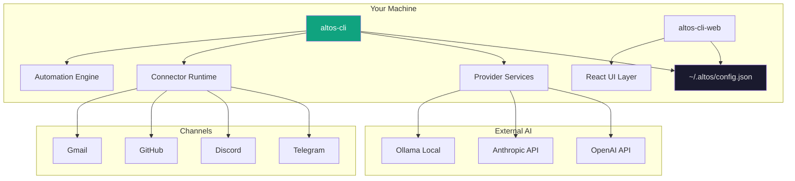

## What is Altos?

Altos is an open-source AI agent platform built for developers who want the power of AI automation without the overhead of enterprise platforms. It runs on your machine, talks to your terminal, and keeps your data where you control it.

Think of it as a lightweight alternative to bloated agent frameworks — the kind of tool that feels obvious once you start using it.

## Why Altos?

| | Heavy Platforms | Altos |
|---|----------------|-------|
| **Setup** | Hours of config | `altos init`, done |
| **Data** | Their servers | Your machine |
| **Running** | Always cloud | Local-first |
| **Learning** | Steep curves | You already know the CLI |
| **Cost** | Per-seat, surprise bills | Pay for AI APIs only |

## Ecosystem Overview

Altos is a small ecosystem of focused tools — each doing one thing well.



**CLI is primary.** Everything else is optional enhancement.

## Repository Structure

```
altos-agent/                          # Root umbrella
├── README.md                         # You are here
├── ARCHITECTURE.md                   # System diagrams
├── DEVELOPER.md                      # Dev setup guide
├── CONTRIBUTING.md                   # PR guidelines
├── CONVENTIONS.md                   # Coding standards
├── ENV_VARS.md                      # Environment reference
│
├── examples/                         # Example configs
│   ├── config.json                   # Full config reference
│   ├── automations/                  # 5 automation recipes
│   └── connectors/                   # Telegram, Discord, GitHub, Gmail
│
├── guides/
│   └── FIRST_HOUR.md                 # First hour with Altos
│
├── docs/
│   └── automation-architecture.md     # Automation system design
│
├── altos/                            # Implementation monorepo
│   ├── altos-cli/                    # TypeScript CLI
│   ├── altos-web/
│   │   ├── altos-cli-web/            # React control panel
│   │   └── altos-web-main/           # Next.js product site
│   └── docs/                         # Phase 1-6 documentation
│
├── altos-cloud/                      # Cloud architecture planning
│   └── docs/                         # 7 planning documents
│
└── altos-app/                        # Desktop app architecture planning
    └── docs/                         # 7 planning documents
```

## Product Pillars

### 🤖 Agent Management

Create agents with distinct personalities, each with its own system prompt, model, and tool access. Switch between them with one command or route requests automatically based on context.

### 🌐 Multi-Provider AI

Connect OpenAI, Anthropic, Google, or run models locally with Ollama. Mix and match based on cost, latency, or capability. No vendor lock-in.

### 🔌 Connector System

Plug into the tools you already use. Telegram bots, Discord servers, GitHub webhooks, Gmail — all with consistent configuration and OAuth token handling.

### ⚡ Automation Engine

Build workflows with triggers (schedule, webhook, event), optional conditions, and chains of actions. Human approval gates for critical operations.

### 🔒 Local-First Security

API keys live in `~/.altos/`, never on remote servers. Config file permissions protected. You audit everything.

## Architecture



## Main Capabilities

| Capability | Description |
|------------|-------------|
| **Provider Registry** | 8 AI providers, unified interface, automatic fallback |
| **Agent Engine** | Create, configure, and run multiple AI agents |
| **Connector Runtime** | Telegram, Discord, GitHub, SSH, Webhook |
| **Automation Scheduler** | Cron-based triggers, event-driven actions |
| **Diagnostics** | `altos doctor` checks connectivity and config health |
| **Onboarding** | Interactive first-run setup with guided configuration |

## Integrations

```
┌─────────────────────────────────────────────────────┐
│                  Supported Channels                  │
├─────────────────────────────────────────────────────┤
│  Messaging     │  Google      │  Infrastructure   │
│  ─────────────┼──────────────┼───────────────────  │
│  📱 Telegram   │  📧 Gmail    │  🐙 GitHub        │
│  💬 Discord    │  📅 Calendar │  🖥️ SSH          │
│  💼 Slack      │  📁 Drive   │  🔗 Webhook       │
│  💬 WhatsApp   │             │                   │
│  🐦 Twitter    │             │                   │
└─────────────────────────────────────────────────────┘
```

OAuth-based channels (Gmail, Slack, Discord) handle token management automatically. CLI-based channels (Telegram, SSH, Webhook) work with simple bot tokens or secrets.

## Automation

Automations are trigger → conditions? → actions chains.

```yaml
# Morning digest — runs at 8 AM weekdays
automation:
  name: daily-digest
  trigger:
    type: schedule
    cron: "0 8 * * 1-5"
  actions:
    - type: summarize
      source: gmail
      filter: "is:unread newer_than:1d"
    - type: send_message
      channel: telegram
      message: "{{summary}}"
```

```yaml
# PR review — triggers on GitHub PR opened
automation:
  name: pr-review-assistant
  trigger:
    type: webhook
    events: [pull_request.opened]
  actions:
    - type: call_llm
      prompt: "Review this PR for security, performance, style..."
      model: claude-3-5-sonnet
    - type: request_approval
      approver: tech-lead
    - type: send_message
      channel: discord
```

## Quick Start

```bash
# Install the CLI
npm install -g altos-cli

# Initialize — this asks a few questions, done in 2 minutes
altos init

# Add an AI provider
altos provider add openai
# → Enter API key: sk-...

# Create your first agent
altos agent create my-assistant

# Start chatting
altos chat

# Open the visual control panel
altos web
# → http://localhost:3847

# Check system health
altos doctor
```

That's it. No Docker, no cloud signup, no config files to create manually.

## Workspace Layout

```
~/.altos/
├── config.json          # Main configuration (providers, agents, channels)
├── credentials.json     # Encrypted secrets (future)
└── data/
    ├── memory/          # Vector embeddings for agent memory
    ├── logs/            # Execution logs
    └── cache/           # Provider response cache
```

Everything lives locally. Sync to cloud is opt-in, never required.

## Tech Stack

| Layer | Technology |
|-------|------------|
| CLI | TypeScript, Node.js, Commander.js, Inquirer.js |
| Web Panel | React, Vite, Tailwind CSS |
| Product Site | Next.js 14, Tailwind CSS |
| Config | JSON (local), YAML (examples) |
| Providers | REST APIs (OpenAI-compatible) |
| Desktop (future) | Tauri, React Native |

## Roadmap

| Phase | Focus | Status |
|-------|-------|--------|
| **v0.1** | Foundation: CLI, providers, basic agents | ✅ Done |
| **v0.2** | Local automation engine | Building |
| **v0.3** | Channel connections (Telegram, Discord) | Planned |
| **v0.4** | Full automation builder | Planned |
| **v1.0** | Cloud sync, team workspaces | Future |
| **v1.1** | Desktop app (macOS, Windows, Linux) | Future |

Cloud and desktop are on the roadmap but are additive — the CLI works today, fully offline.

## Documentation Map

| Guide | What You Get |
|-------|--------------|
| [First Hour](guides/FIRST_HOUR.md) | 15-min → 30-min → 15-min intro to all features |
| [Architecture](ARCHITECTURE.md) | System diagrams, data flows, design decisions |
| [Developer Setup](DEVELOPER.md) | Dev environment, running locally, IDE setup |
| [Automation Guide](docs/automation-architecture.md) | Trigger/action reference, examples |
| [ENV Variables](ENV_VARS.md) | All environment variables documented |
| [Cloud Vision](altos-cloud/docs/cloud-vision.md) | Why cloud, what it enables |
| [Desktop Vision](altos-app/docs/app-vision.md) | Native shell, system tray |

## Why Not Other Platforms?

Most AI agent platforms assume you want to build an enterprise deployment from day one. Altos assumes you want to ship something that works today and grows with you.

- **No required cloud** — run fully offline
- **No required dashboard** — CLI is primary
- **No steep learning curve** — if you know `npm`, you know Altos
- **No per-seat pricing** — just pay for your API usage
- **No vendor lock-in** — export your config, it stays yours

## Contributing

Contributions welcome. See [CONTRIBUTING.md](CONTRIBUTING.md) for:

- Fork and branch workflow
- Commit message conventions
- PR checklist
- Areas where help is needed (connectors, automation actions, docs)

## License

MIT — use freely, modify freely, no strings attached. See individual module licenses for details.

---

<div align="center">

**Built for developers who want AI agents that stay out of the way.**

</div>
