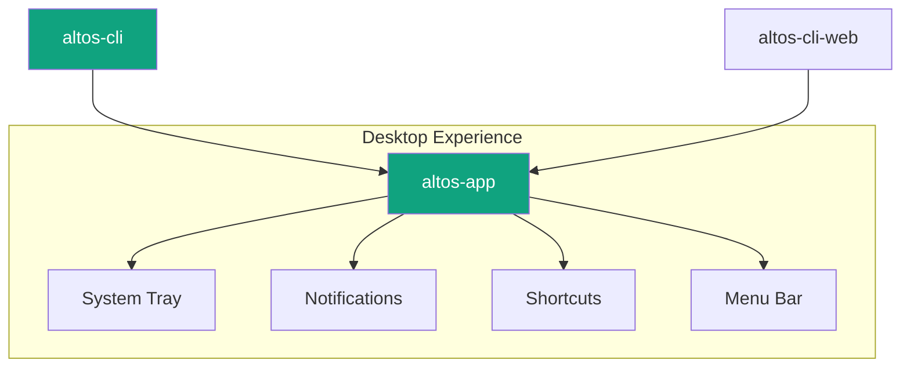
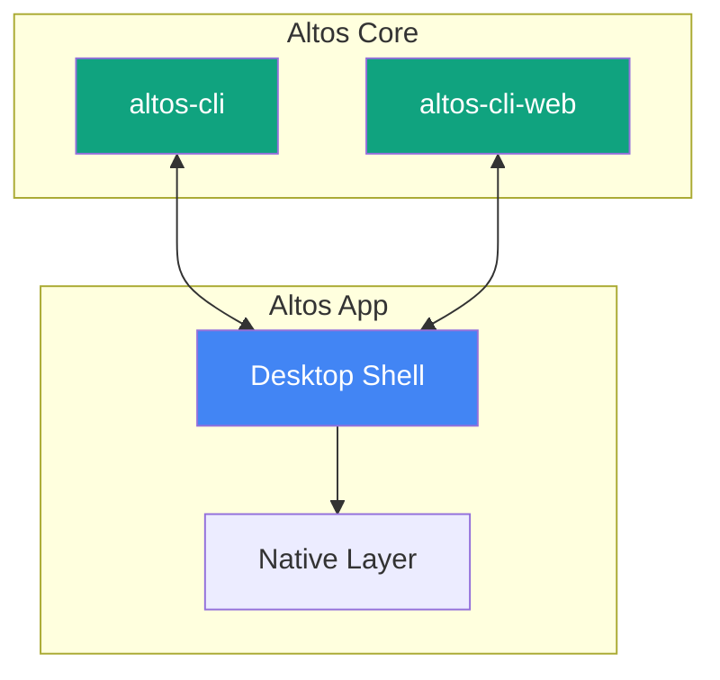
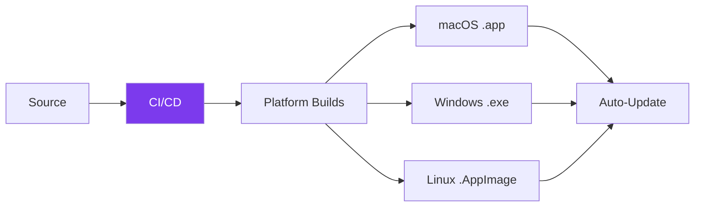

---

# altos-app

**The native desktop shell for Altos.**

*System tray presence, native notifications, and smoother workflows — the desktop layer that makes Altos feel at home on your machine.*

---

## Current Status

🚧 **This repository is in the planning phase.**

Altos-app is not yet built. What exists here is the product vision, platform strategy, and architecture design for a native desktop application that complements the CLI and web panel.

The planning documents are complete. Implementation begins after the CLI automation engine reaches stability.

## Why Altos App?

The CLI runs in a terminal. The web panel runs in a browser. Neither owns the desktop experience.

A native app makes Altos feel like a first-class citizen on your machine:

**What this unlocks:**

- Altos agents running in the background while you work
- Native notifications when automations complete or need attention
- Global shortcuts to trigger agents from anywhere
- File watching — drop a file, an agent processes it
- Menu bar access without switching contexts

## Planned Desktop Experience

### System Tray

Altos lives in your menu bar or system tray:

- **Agent status** — See which agents are running at a glance
- **Quick actions** — Run frequently-used agents with one click
- **Activity feed** — Recent executions, errors, completions
- **Toggle automations** — Enable or disable without opening a terminal

### Native Notifications

System alerts that cut through:

- Automation completed or failed
- Agent needs input
- Scheduled reminder triggered
- Connection status changes

Notifications are grouped by priority and respect Do Not Disturb schedules.

### Global Shortcuts

Bind Altos actions to keyboard shortcuts:

- `Cmd+Shift+A` — Open quick chat
- `Cmd+Shift+R` — Run default agent on clipboard content
- `Cmd+Shift+D` — Toggle dashboard

File watchers trigger automations on changes to watched folders.

## Relationship to CLI and Web

**Principles:**

- `altos-cli` is still the control surface — app is a visual layer on top
- Same config at `~/.altos/config.json`
- App enhances the CLI experience, never replaces it
- Works fully offline — no cloud required

## Target Platforms

| Platform | Status | Notes |
|----------|--------|-------|
| **macOS** | 🏗️ Planned | Menu bar extra, Spotlight integration |
| **Windows** | 🏗️ Planned | System tray, Jump lists |
| **Linux** | 🏗️ Planned | AppIndicator, system tray |

**Framework:** Tauri — Rust core, web view UI. Smaller binary, faster startup, better resource usage than Electron.

## Planned Capabilities

| Capability | Description |
|------------|-------------|
| **System Tray** | Persistent presence, quick actions, status at a glance |
| **Notifications** | Native OS alerts for events, grouped by priority |
| **Global Shortcuts** | Keyboard bindings for frequent actions |
| **File Watching** | Folder watchers that trigger automations |
| **Menu Bar** | Quick access without switching windows |
| **Offline Mode** | Full functionality without internet |
| **Background Runtime** | Agents run even when terminal is closed |
| **Auto-Start** | Launches at system startup, minimized to tray |

## Packaging and Update Strategy

**Packaging goals:**

- Native installers per platform — DMG, MSI, AppImage
- Code signing for macOS and Windows
- Auto-update via Tauri updater with delta patches
- Rollback support if updates fail

**CI/CD targets:**

- macOS: x64 + ARM (Apple Silicon)
- Windows: x64
- Linux: x64, AppImage + deb

See [docs/packaging-plan.md](docs/packaging-plan.md) for full build configuration.

## Offline and Local-First Direction

The desktop app is the most local experience of Altos:

- **No cloud required** — Full agent and automation execution locally
- **Works without internet** — All core features function offline
- **Sync queue** — Cloud-dependent operations queue and retry
- **Local SQLite** — Structured data store alongside config JSON

The desktop app is the strongest expression of the local-first principle — Altos running natively on your machine, fully under your control.

See [docs/offline-mode.md](docs/offline-mode.md) for the offline architecture.

## Planned Documentation

Seven documents define the desktop application:

| Document | Purpose |
|----------|---------|
| [app-vision.md](docs/app-vision.md) | Product vision, design principles |
| [platform-strategy.md](docs/platform-strategy.md) | Tauri vs Electron, cross-platform decisions |
| [desktop-architecture.md](docs/desktop-architecture.md) | Shell architecture, IPC design |
| [packaging-plan.md](docs/packaging-plan.md) | Build configs, CI/CD pipeline |
| [update-strategy.md](docs/update-strategy.md) | Auto-updates, delta patches, rollback |
| [offline-mode.md](docs/offline-mode.md) | Offline-first architecture |
| [roadmap.md](docs/roadmap.md) | Implementation phases |

## Roadmap

| Phase | Focus | Status |
|-------|-------|--------|
| **Foundation** | Tauri shell, WebView integration, basic tray | Future |
| **Notifications** | Native alerts, notification center | Future |
| **Shortcuts** | Global hotkeys, file watchers | Future |
| **Auto-Update** | Update server, delta patches, rollback | Future |
| **Polish** | Performance, stability, platform tweaks | Future |

Desktop app development starts after the CLI automation engine is stable.

## Contributing

Contributions to architecture and design welcome:

- Review of Tauri vs Electron tradeoffs
- Cross-platform UX expertise
- Build pipeline and packaging experience
- Security review of the offline model

This is a design-first repository. Code contributions will arrive in later phases.

See [CONTRIBUTING.md](../../CONTRIBUTING.md) in the root for the full workflow.

## License

MIT — same as the rest of Altos.

---

**Altos on your desktop. Local, native, unobtrusive.**

