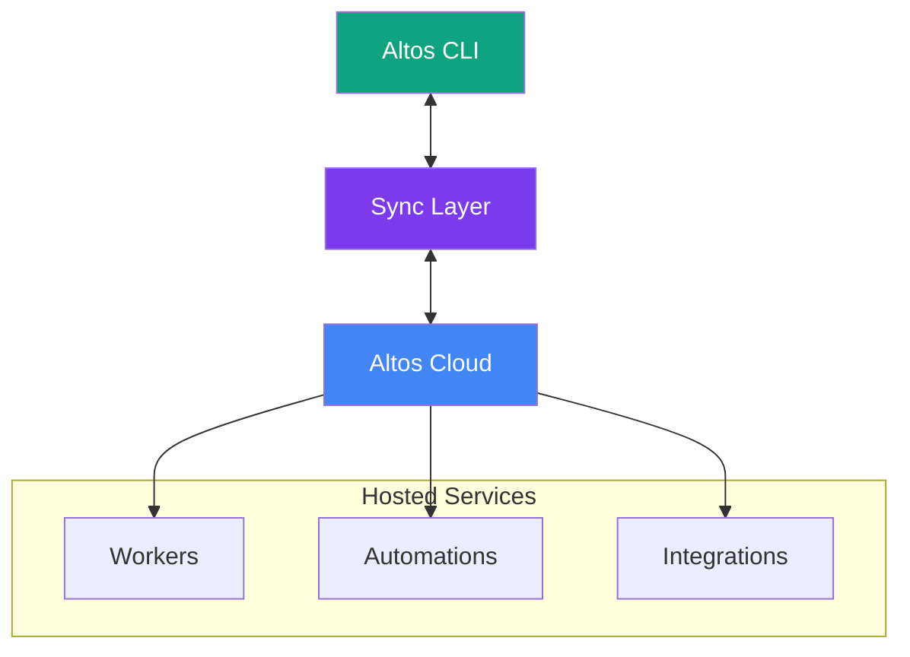
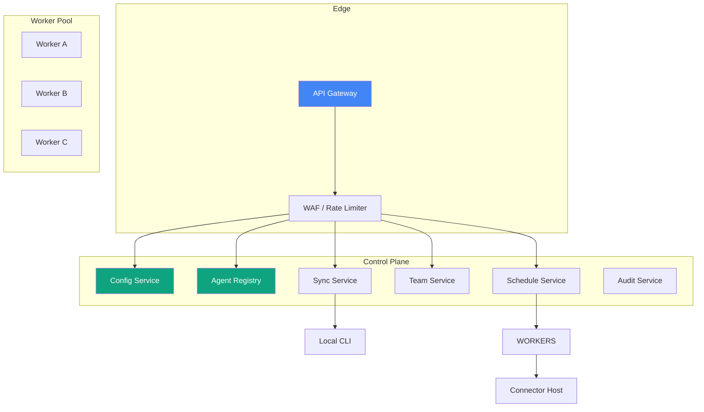
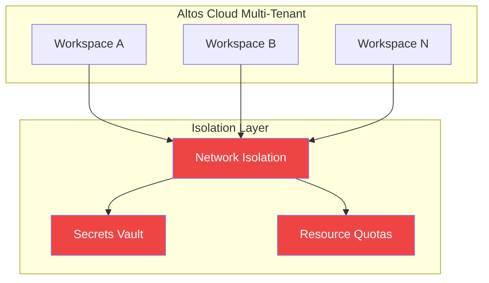
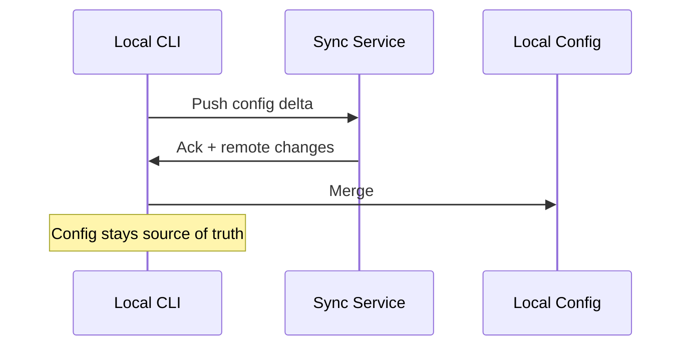

---

# altos-cloud

**The hosted layer for the Altos ecosystem.**

*Remote agent execution, managed automation, and team workspaces — built on a local-first foundation.*

---

## Current Status

🚧 **This repository is in the planning phase.**

The cloud layer of Altos is not yet implemented. What exists here is the complete architectural design — seven documents covering every major system in detail.

This README defines where altos-cloud is going, why it's going there, and how it fits into the broader Altos ecosystem.

## What Altos-Cloud Will Become

Altos-cloud is the hosted runtime and control plane for Altos. It handles workloads that benefit from remote execution — persistent automations, team collaboration, and centralized observability — while leaving the local CLI as the primary interface.

Cloud is **additive**. The CLI works fully offline today without it.

## Why Cloud Exists in a Local-First Ecosystem

Local-first is a philosophy, not a constraint. Some things work better remote:

| Workload | Local | Cloud |
|----------|-------|-------|
| **Interactive chat** | ✅ Instant | ❌ Latency |
| **Persistent automations** | ❌ Needs machine on | ✅ Always runs |
| **Team collaboration** | ❌ Single user | ✅ Shared workspaces |
| **Heavy workloads** | ❌ Hardware limited | ✅ Scales up |
| **Observability** | ❌ Local logs only | ✅ Centralized |

The sync layer ensures your local config stays the source of truth — cloud is an extension, not a replacement.

## Planned Capabilities

### Remote Agent Execution

Run agents on managed infrastructure when local resources are insufficient or the machine is offline.

- Auto-scaling worker pools
- Containerized agent environments
- Connector host for integrations that need persistent connections
- Resource quotas per workspace

### Managed Automation

Cloud-hosted automation scheduling that survives local outages.

- Cron and event-driven triggers
- Durable execution queues
- Retry and timeout policies
- Approval gates for critical workflows

### Team Workspaces

Shared environments for teams building with Altos.

- Workspace-level config sharing
- Role-based access control
- Audit logs for team actions
- Per-user agent memories

### Secrets Management

Secure storage and rotation for credentials.

- Encrypted secrets vault
- Connector credential storage
- API key rotation policies
- Access controls per workspace

### Unified Observability

Centralized view across local and cloud executions.

- Execution logs and traces
- Token usage and cost tracking
- Provider health monitoring
- Alerting and notifications

## Architecture Vision

The control plane is composed of focused services:

See [docs/cloud-architecture.md](docs/cloud-architecture.md) for full data flows.

## Control Plane and Worker Concepts

### Control Plane

The API surface for all cloud operations. Handles:

- **Config Service** — Workspace configuration, provider keys, agent definitions
- **Agent Registry** — Published agents, version history, discovery
- **Schedule Service** — Cron management, durable timers
- **Team Service** — Users, roles, workspace membership
- **Sync Service** — Bidirectional config sync with local CLIs
- **Audit Service** — Action logs, compliance tracking

### Workers

Stateless execution nodes that run agent workloads.

- Pull jobs from a queue
- Execute in isolated containers
- Connect to the Connector Host for inbound webhooks
- Report status and logs back to the control plane

### Connector Host

A long-running process that maintains persistent connections for integrations:

- Telegram long polling
- Discord bot gateway
- GitHub webhook receiver
- Inbound SMTP for Gmail

## Security and Tenancy Model

**Zero-trust architecture:**

- All inter-service communication encrypted (mTLS)
- Workspace-level network isolation
- Secrets never exposed to tenant code
- Audit logs immutable

**Data residency:**

- Config data encrypted at rest
- Configurable region selection (future)
- Local data remains local — cloud stores sync metadata only

See [docs/security-model.md](docs/security-model.md) and [docs/multitenancy-plan.md](docs/multitenancy-plan.md).

## Sync Model

The sync layer is the bridge between local and cloud.

**Sync principles:**

- Local config is always the source of truth
- Cloud stores a mirror of local config for remote access
- Conflict resolution: last-write-wins with local priority
- Secrets never sync — only references

See [docs/cloud-architecture.md](docs/cloud-architecture.md) for full sync protocol details.

## Planned Docs in This Repo

Seven architecture documents covering every major system:

| Document | Status | Purpose |
|----------|--------|---------|
| [cloud-vision.md](docs/cloud-vision.md) | ✅ Complete | Philosophy, principles, design values |
| [cloud-architecture.md](docs/cloud-architecture.md) | ✅ Complete | System overview, data flows |
| [control-plane-design.md](docs/control-plane-design.md) | ✅ Complete | Service designs, APIs |
| [worker-design.md](docs/worker-design.md) | ✅ Complete | Job execution, containers |
| [security-model.md](docs/security-model.md) | ✅ Complete | AuthN/Z, encryption, secrets |
| [multitenancy-plan.md](docs/multitenancy-plan.md) | ✅ Complete | Workspace isolation, quotas |
| [roadmap.md](docs/roadmap.md) | ✅ Complete | Implementation phases |

## Roadmap Phases

| Phase | Focus | Status |
|-------|-------|--------|
| **Foundation** | Control plane core, agent registry, basic workers | Future |
| **Sync** | Bidirectional sync, local-first reconciliation | Future |
| **Team** | Workspaces, RBAC, team dashboard | Future |
| **Enterprise** | SSO/SAML, audit logs, data residency | Future |

Cloud development begins after the CLI automation engine is stable. Local-first remains the priority.

## Contribution Model

Contributions to architecture docs welcome:

- Review of design decisions in the planning docs
- Security and compliance expertise
- Operational experience from similar systems

This is a design-first repository. Code contributions will come in later phases.

See [CONTRIBUTING.md](../../CONTRIBUTING.md) in the root for the full workflow.

## License

MIT — same as the rest of Altos.

---

**Cloud when you need it. Local when you don't. Config stays yours.**

