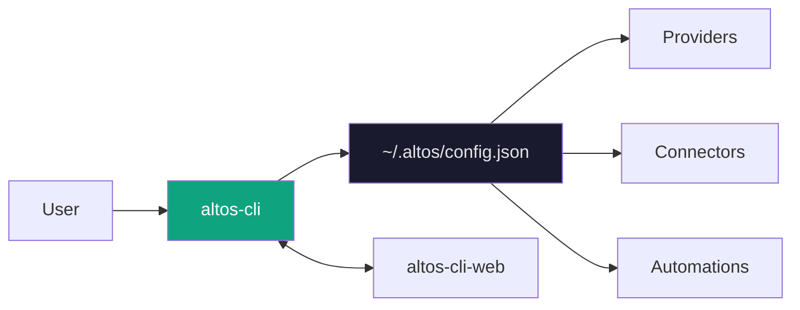

---

<div align="center">

# altos-cli

**The command line is the control surface.**

*Altos CLI is the primary interface for the Altos AI agent platform — a lightweight, local-first tool for managing AI providers, integrations, and automations.*

[](https://www.npmjs.com/package/altos-cli)
[](https://opensource.org/licenses/MIT)
[](https://nodejs.org/)
[](https://www.typescriptlang.org/)

</div>

---

## What is altos-cli?

`altos-cli` is the nerve center of Altos. It's not just a command runner — it's the main control surface for a local AI agent system that lives on your machine.



Everything you configure through the CLI persists locally. The optional web panel reads the same config — no duplication, no sync issues.

## Why CLI-First?

The terminal is where developers live. CLI-first means:

- **Speed** — No clicking through menus. Commands are faster.
- **Scriptability** — Pipe outputs, chain workflows, automate.
- **Transparency** — You see exactly what's happening.
- **Reproducibility** — Config in files, version controlled.
- **Remote access** — SSH into any machine, run your agents.

The web panel is there when you want visual confirmation or quick glancing — but it's never required.

## Core Capabilities

| Capability | What it does |
|------------|--------------|
| **Provider Registry** | Connect OpenAI, Anthropic, Google, Ollama, and 4 more |
| **Agent Management** | Create agents with distinct prompts, models, and behaviors |
| **Integration Connectors** | Telegram bots, Discord servers, GitHub webhooks, SSH |
| **Automation Engine** | Cron triggers, event hooks, action chains |
| **Interactive Onboarding** | Guided first-run setup |
| **Diagnostics** | `altos doctor` surfaces and fixes issues |

---

## Installation

```bash
# Requires Node.js 18+
npm install -g altos-cli

# Verify
altos --version
```

That's it. No Docker, no system dependencies beyond Node.

## Quick Start

```bash
# 1. Initialize — asks a few questions, takes 2 minutes
altos init

# 2. Add an AI provider
altos provider add openai

# 3. List what's configured
altos provider list

# 4. Create an agent
altos agent create my-assistant

# 5. Chat with it
altos chat

# 6. Open the web panel
altos web

# 7. Check everything is healthy
altos doctor
```

## Onboarding Flow

`altos init` walks you through setup step by step:

```
? Welcome to Altos. Let's get you set up.
? Select your first provider:
  > OpenAI
    Anthropic
    Google
    Ollama (local)
? Enter your API key: ••••••••••••••••••••••
✓ Connected to OpenAI (47ms)
? Create your first agent name: my-assistant
✓ Agent "my-assistant" created
✓ Setup complete. Run 'altos chat' to start.
```

Onboarding is resumable — if you exit early, `altos setup resume` picks up where you left off.

---

## Commands Overview

### Core

| Command | What it does |
|---------|--------------|
| `altos init` | Initialize or resume onboarding |
| `altos doctor` | Run diagnostics, suggest fixes |
| `altos env` | Show Node.js, npm, git versions |
| `altos help` | Show all commands |

### Providers

| Command | What it does |
|---------|--------------|
| `altos provider add [type]` | Add a provider interactively |
| `altos provider add [type] --api-key sk-...` | Add non-interactive |
| `altos provider list` | Show configured providers |
| `altos provider test [type]` | Test connection |
| `altos provider remove [type]` | Remove a provider |

### Models

| Command | What it does |
|---------|--------------|
| `altos model list` | List models across all providers |
| `altos model list openai` | List models for specific provider |

### Agents

| Command | What it does |
|---------|--------------|
| `altos agent create [name]` | Create an agent |
| `altos agent list` | List all agents |
| `altos agent use [id]` | Set default agent |
| `altos agent delete [id]` | Delete an agent |

### Channels

| Command | What it does |
|---------|--------------|
| `altos channel list` | Show available connectors |
| `altos channel connect [type]` | Configure a connector |
| `altos channel status [type]` | Check connector health |
| `altos channel test [type]` | Test connection |
| `altos channel disconnect [type]` | Disconnect |
| `altos channel remove [type]` | Remove configuration |

### Automations

| Command | What it does |
|---------|--------------|
| `altos automation list` | List all automations |
| `altos automation create [name]` | Create an automation |
| `altos automation toggle [id]` | Enable or disable |
| `altos automation delete [id]` | Delete |

### Chat

| Command | What it does |
|---------|--------------|
| `altos chat` | Start interactive session |
| `altos chat --agent my-assistant` | Chat with specific agent |

### Configuration

| Command | What it does |
|---------|--------------|
| `altos config show` | Print current config |
| `altos config edit` | Open in `$EDITOR` |
| `altos config reset` | Reset to defaults |

### Web

| Command | What it does |
|---------|--------------|
| `altos web` | Launch control panel (port 3847) |
| `altos web --full` | Launch full dashboard (port 3848) |
| `altos web --port 3000` | Use custom port |

---

## Provider Support

Eight providers, unified interface, automatic fallback.

| Provider | Type | API Key | Default Models |
|----------|------|---------|---------------|
| **OpenAI** | Cloud | Required | `gpt-4o`, `gpt-4o-mini`, `gpt-4-turbo` |
| **Anthropic** | Cloud | Required | `claude-3-5-sonnet-latest`, `claude-3-opus-latest` |
| **Google** | Cloud | Required | `gemini-1.5-pro`, `gemini-1.5-flash` |
| **OpenRouter** | Cloud | Required | `anthropic/claude-3-opus`, `openai/gpt-4o` |
| **Ollama** | Local | None | `llama3`, `mistral`, `codellama` |
| **Groq** | Cloud | Required | `llama3-70b-8192`, `mixtral-8x7b-32768` |
| **Together** | Cloud | Required | `togethercomputer/llama-3-70b-chat` |
| **Custom** | Both | Required | Any OpenAI-compatible endpoint |

Adding a provider:

```bash
# Interactive — asks for API key
altos provider add openai

# Non-interactive — pass the key directly
altos provider add openai --api-key sk-...

# For local Ollama, just specify the base URL
altos provider add ollama --base-url http://localhost:11434
```

## Model Routing

Altos doesn't force you to pick one model forever. Route by:

- **Quality** — `gpt-4o` for complex reasoning, `gpt-4o-mini` for simple tasks
- **Latency** — Fast models for real-time, slower for batch
- **Cost** — Route cheap requests to `gpt-4o-mini`

```bash
# List models for a provider
altos model list openai

# See models across all providers
altos model list
```

## Integration Setup

Connect external services through the connector system.

```bash
# See what's available
altos channel list

# Connect Telegram
altos channel connect telegram

# Connect Discord
altos channel connect discord

# Check health
altos channel status

# Test a specific channel
altos channel test telegram
```

Supported connectors:

| Connector | Auth | Use Case |
|-----------|------|----------|
| Telegram | Bot token | Chat bots, alerts |
| Discord | Bot token | Server bots, slash commands |
| GitHub | Webhook + token | PR reviews, issue triage |
| Gmail | OAuth | Email summaries, auto-replies |
| SSH | Key-based | Remote command execution |
| Webhook | Secret token | Generic HTTP callbacks |

## Automation Bootstrap

Automations are trigger → conditions? → actions chains.

```bash
# Create a new automation
altos automation create daily-digest
```

Example automation config:

```yaml
name: morning-digest
trigger:
  type: schedule
  cron: "0 8 * * 1-5"   # 8 AM weekdays
actions:
  - type: summarize
    source: gmail
    filter: "is:unread newer_than:1d"
  - type: send_message
    channel: telegram
    message: "{{summary}}"
```

```yaml
name: pr-review-assistant
trigger:
  type: webhook
  events: [pull_request.opened]
actions:
  - type: call_llm
    prompt: "Review this PR for bugs, style, security..."
    model: claude-3-5-sonnet
  - type: request_approval
    approver: tech-lead
  - type: send_message
    channel: discord
```

Enable, disable, or toggle automations:

```bash
altos automation list
altos automation toggle daily-digest
altos automation delete old-automation
```

## Web Panel Launch

```bash
# Start the lightweight control panel
altos web

# Opens http://localhost:3847
```

The web panel is a visual layer on top of the same config. It doesn't replace the CLI — it complements it.

For the full dashboard:

```bash
altos web --full
# Opens http://localhost:3848
```

## Configuration

Config lives at `~/.altos/config.json`:

```json
{
  "version": "1.0.0",
  "configVersion": 1,
  "providers": {
    "openai": {
      "type": "openai",
      "apiKey": "sk-...",
      "models": ["gpt-4o", "gpt-4o-mini"]
    }
  },
  "agents": {
    "my-assistant": {
      "id": "...",
      "name": "my-assistant",
      "provider": "openai",
      "model": "gpt-4o",
      "systemPrompt": "You are a helpful assistant.",
      "temperature": 0.7
    }
  },
  "automations": [],
  "channels": {},
  "meta": {
    "mode": "local-web",
    "lastModified": "2024-01-01T00:00:00.000Z"
  }
}
```

View config directly:

```bash
altos config show
```

Edit in your editor:

```bash
altos config edit
```

Reset to defaults:

```bash
altos config reset
```

## Diagnostics

`altos doctor` checks everything and tells you what's wrong:

```
Checking Altos setup...

✓ Node.js v20.10.0
✓ npm v10.2.0
✓ Config file exists (~/.altos/config.json)
✓ 2 providers configured
✓ 1 agent created
✓ Telegram connector configured

Warnings:
⚠ Ollama not running. Start with: ollama serve

Run 'altos provider add ollama' to reconfigure.
```

## Example Workflows

### First-Time Setup

```bash
altos init
# → Answer the prompts

altos provider add openai
# → Enter API key

altos agent create my-assistant
altos chat
```

### Daily Development

```bash
# Check morning status
altos doctor

# Chat with your assistant
altos chat --agent my-assistant

# Check what automations are running
altos automation list

# View logs
altos logs --tail 50
```

### Connecting a Channel

```bash
# See available channels
altos channel list

# Connect Telegram
altos channel connect telegram
# → Enter bot token from @BotFather

# Verify connection
altos channel test telegram
altos channel status telegram
```

## Architecture Notes

```
altos-cli/src/
├── bin/
│   └── index.ts           # Entry point, command registration
├── config/
│   └── manager.ts         # Config CRUD, versioning, migration
├── connectors/
│   ├── base/              # Connector interface, registry
│   ├── telegram/          # Telegram implementation
│   ├── github/            # GitHub implementation
│   ├── ssh/               # SSH implementation
│   └── webhook/           # Webhook implementation
├── onboarding/
│   ├── flow.ts           # Interactive setup orchestration
│   └── state.ts          # Onboarding progress tracking
├── providers/
│   └── ...               # Provider adapters (in services/)
├── services/
│   ├── provider.ts       # AI API calls, model listing
│   ├── diagnostics.ts    # System health checks
│   ├── connectors.ts     # Connector management
│   └── errors.ts         # Error types and formatting
├── types/
│   └── index.ts          # Shared TypeScript types
└── ui/
    └── output.ts          # Chalk formatting, spinners, tables
```

**Design principles:**

- Config is the source of truth
- CLI and web panel operate on the same config
- Provider calls are abstracted — swap providers without changing agents
- Connectors are pluggable — add new ones without touching core

## Roadmap

| Version | Focus | Status |
|---------|-------|--------|
| **v0.1** | Provider setup, agents, basic chat | ✅ Done |
| **v0.2** | Automation execution engine | Building |
| **v0.3** | Telegram, Discord connectors | Planned |
| **v0.4** | Visual automation builder in web | Planned |
| **v1.0** | Cloud sync, team workspaces | Future |

The CLI is stable. Automations and connectors are being actively developed.

## Contributing

Contributions welcome. Key areas:

- **New connectors** — Telegram, Discord, GitHub, SSH implementations
- **Automation actions** — More action types for workflows
- **Documentation** — Setup guides, connector docs
- **Tests** — Unit and integration coverage

See [CONTRIBUTING.md](../../CONTRIBUTING.md) in the root for the full workflow.

## License

MIT — use it, change it, ship with it.

---

<div align="center">

**The terminal is the dashboard. The config is the source of truth. The CLI is primary.**

</div>