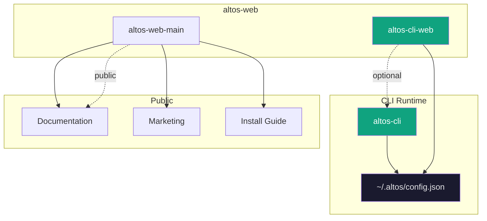
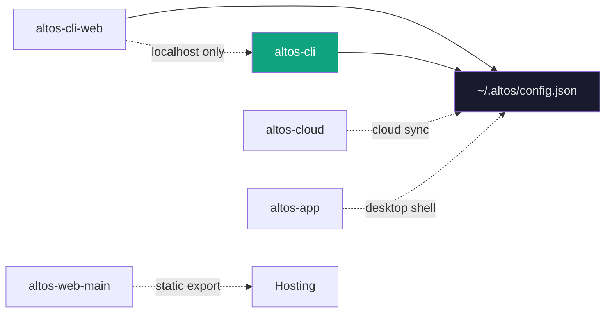

---

<div align="center">

# altos-web

**The web surface of the Altos ecosystem.**

*Two focused web products — one for local control, one for public presence.*

[](https://opensource.org/licenses/MIT)
[](https://react.dev/)
[](https://www.typescriptlang.org/)
[](https://nextjs.org/)

</div>

---

## What is altos-web?

`altos-web` is the web layer of Altos — a thin umbrella containing two distinct web products:

| Product | Purpose |
|---------|---------|
| **altos-cli-web** | Local control panel for the CLI runtime |
| **altos-web-main** | Public website, docs, and marketing |

They serve different audiences but share design language, types, and conventions.

## Repository Scope

```
altos-web/
├── README.md                 # This file
│
├── altos-cli-web/            # Local control panel (Vite + React)
│   ├── src/
│   │   ├── pages/           # Dashboard, Providers, Agents, Channels, etc.
│   │   ├── components/      # Shared UI components
│   │   ├── hooks/           # React hooks (useConfig, useData)
│   │   ├── lib/             # API client, types
│   │   └── stores/          # Zustand state
│   ├── package.json
│   └── vite.config.ts
│
└── altos-web-main/           # Public site (Next.js 14)
    ├── src/
    │   ├── app/             # Next.js App Router pages
    │   ├── components/       # Marketing components
    │   └── lib/             # Shared utilities
    ├── package.json
    └── next.config.js
```

## Included Apps

### altos-cli-web

**Port: 3847** | **Stack: Vite + React + TypeScript**

A lightweight visual layer on top of the CLI config. Launched by `altos web` from the terminal.

**What it does:**

- Provider management with API key configuration
- Agent creation and configuration
- Channel/connector status overview
- Automation list and basic management
- Diagnostic dashboard

**Launch:**
```bash
altos web
# → http://localhost:3847
```

**Pages:**
- Dashboard — system status, quick actions
- Providers — configure AI providers
- Models — view available models per provider
- Agents — manage AI agents
- Channels — connector health and status
- Automations — list and toggle
- Logs — execution history (UI shell)
- Settings — config location, version info

### altos-web-main

**Port: 3848** | **Stack: Next.js 14 + TypeScript**

The public face of Altos. Marketing site, documentation, and install guides.

**What it does:**

- Product landing page
- Installation guide
- Full documentation
- Integration showcase
- Roadmap and feature announcements

**Launch:**
```bash
altos web --full
# → http://localhost:3848
```

## Why Two Web Surfaces?

The split reflects a fundamental principle: **local-first, optional web**.



**altos-cli-web** is for developers who want a visual supplement to the terminal. It stays local, reads local config, and works offline.

**altos-web-main** is for discovery, documentation, and onboarding. It can be hosted publicly as the product website.

## Design System Direction

Both products share a common visual language:

| Element | Direction |
|---------|-----------|
| **Theme** | Dark glass-morphism — translucent cards, subtle borders |
| **Accent** | Emerald primary, cyan secondary |
| **Typography** | Inter — clean, modern, readable |
| **Motion** | Subtle fade-in transitions, no heavy animation |
| **Layout** | Sidebar navigation, content area, generous whitespace |

```css
/* Design token examples */
--color-bg: #0a0a0f;
--color-card: rgba(26, 26, 36, 0.95);
--color-border: rgba(255, 255, 255, 0.08);
--color-accent: #10a37f;
--color-accent-secondary: #06b6d4;
--color-text: #e4e4e7;
--color-muted: #71717a;
```

Components are built for reuse across both products. UI primitives live in shared directories when appropriate.

## Local-First + Public Web Relationship



**Current state:** `altos-cli` owns the config. Both web panels read from it.

**Future state:** Cloud sync adds bidirectional sync. Desktop app adds local-native UI.

## Architecture Overview

```
altos-cli-web (Vite + React)
│
├── pages/
│   ├── Dashboard.tsx       # System overview
│   ├── Providers.tsx      # Provider list
│   ├── ProviderDetail.tsx  # Per-provider config
│   ├── Models.tsx         # Model browser
│   ├── Agents.tsx         # Agent management
│   ├── Channels.tsx        # Connector status
│   ├── Automations.tsx    # Automation list
│   ├── Logs.tsx           # Log viewer (shell)
│   └── Settings.tsx       # Config info
│
├── components/
│   ├── ui/                # Button, Card, Modal, StatusBadge
│   ├── layout/            # Layout, Sidebar, Navbar
│   ├── providers/          # Provider-specific components
│   ├── agents/            # Agent-specific components
│   ├── channels/          # Channel-specific components
│   └── automation/        # Automation components
│
├── hooks/
│   ├── useConfig.ts       # Config state management
│   └── useData.ts         # API data fetching
│
└── lib/
    ├── api.ts             # Config API client (with localStorage fallback)
    ├── config.ts          # Config types and defaults
    └── types.ts           # Shared types
```

## Development Structure

```bash
# Root — no package.json, just umbrella docs

# altos-cli-web
cd altos-web/altos-cli-web
npm install
npm run dev          # http://localhost:3847

# altos-web-main  
cd altos-web/altos-web-main
npm install
npm run dev          # http://localhost:3848
```

Both can run simultaneously during development.

### API Design

`altos-cli-web` communicates with the CLI through the local config file and an API layer:

```typescript
// lib/api.ts

// Primary: HTTP to CLI API server (future)
// Fallback: localStorage when CLI not running
const CONFIG_PATH = 'http://localhost:3848/api/config';

async function getConfig(): Promise<AltOSConfig> {
  try {
    const res = await fetch(CONFIG_PATH);
    return res.json();
  } catch {
    // Fallback to localStorage for demo/offline mode
    return loadFromLocalStorage();
  }
}
```

The web panel degrades gracefully — if the CLI isn't running, it works from cached localStorage.

## Docs Strategy

Documentation lives in multiple places:

| Location | Content | Audience |
|----------|---------|----------|
| **altos-web-main** | Product docs, install guide | New users |
| **Root README** | Platform overview | Developers evaluating |
| **altos-cli README** | CLI reference | Active users |
| **examples/** | Config and automation YAML | Configuration reference |
| **guides/** | First-hour guide, tutorials | Learning users |

Docs are written in Markdown and rendered by the Next.js site. No third-party docs platform required.

## Roadmap

| Phase | Focus | Status |
|-------|-------|--------|
| **Current** | Provider UI, agent overview, channel status | ✅ Done |
| **v0.2** | Full automation builder UI | Building |
| **v0.3** | Real-time log viewer | Planned |
| **v0.4** | WebSocket sync with CLI | Planned |
| **v1.0** | Unified web interface | Future |

The web products evolve with the CLI. Each feature added to `altos-cli` gets a corresponding UI in `altos-cli-web`.

## Contributing

Contributions to either product welcome.

**For altos-cli-web:**
- UI components and pages
- State management patterns
- API integration with CLI

**For altos-web-main:**
- Documentation pages
- Marketing content
- Site performance

See [CONTRIBUTING.md](../../CONTRIBUTING.md) in the root for the full workflow.

## License

MIT — same as the rest of the Altos ecosystem.

---

<div align="center">

**Visual layer, local-first. Web without the cloud dependency.**

</div>