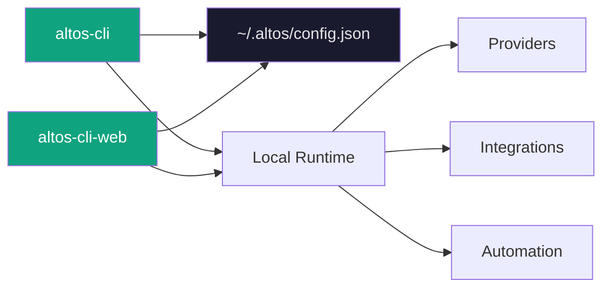

---

<div align="center">

# altos-cli-web

**The local control plane for Altos.**

*A sleek, dark-mode web interface for managing providers, integrations, agents, and automations — launched from the CLI you already use.*

[](https://opensource.org/licenses/MIT)
[](https://react.dev/)
[](https://vitejs.dev/)
[](https://www.typescriptlang.org/)
[](https://tailwindcss.com/)

</div>

---

## What is altos-cli-web?

`altos-cli-web` is the visual companion to `altos-cli`. It runs locally on your machine — no cloud, no accounts — and gives you a dashboard to manage everything the CLI manages, but with visual confirmation and easier browsing.



Launch it with `altos web` from your terminal. It opens at `http://localhost:3847`.

## Why a Local Web Control Panel?

The CLI is primary. The web panel is for when you want:

- **Quick visual status** — See all providers, agents, and channels at a glance
- **Easier browsing** — Navigate integrations without memorizing flags
- **Readable config** — See JSON structured cleanly, not terminal output
- **Shareable context** — Open on a second monitor while you work

It's optional. It never requires internet. It never calls home. It just reads your local config and renders it.

## Core Dashboard Areas

| Page | What it shows |
|------|---------------|
| **Dashboard** | System overview — providers, agents, channels, recent activity |
| **Providers** | All configured AI providers with connection status |
| **Models** | Available models per provider |
| **Agents** | Created agents, their config, default标记 |
| **Channels** | Connector health and status |
| **Automations** | Automation list with enable/disable toggles |
| **Logs** | Execution history and error output |
| **Settings** | Config location, version, defaults |

Each page is a single focused view — no nested admin panels, no dropdown menus three levels deep.

## Key Features

### Provider Management

Visual provider setup with connection testing.

- Add OpenAI, Anthropic, Google, Ollama, Groq, OpenRouter, Together
- See connection status per provider
- Test connectivity with one click
- Masked API key entry — keys never displayed in plain text

### Integrations Overview

See all your connected services in one place.

**Messaging**

- 📱 Telegram — bot status, command prefix, allowed users
- 💬 Discord — guild ID, channel list, bot presence
- 💬 WhatsApp — Business API connection

**Google Workspace**

- 📧 Gmail — OAuth status, label filters
- 📅 Google Calendar — event triggers
- 📁 Google Drive — file watchers

**Productivity**

- 🐙 GitHub — webhook endpoints, repo access
- 📝 Notion — database connections
- 💼 Slack — workspace, channels

**Infrastructure**

- 🖥️ SSH — host keys, command templates
- 🔗 Webhooks — inbound endpoints, event routing

### Automation Center

Visual overview of your automation fleet.

- List all automations with trigger type and action count
- Toggle enabled/disabled at a glance
- See last run time and status
- Quick link to CLI for creation

### Logs and Activity

Execution visibility across providers and agents.

- Provider API call logs
- Agent conversation history
- Automation trigger events
- Error traces with timestamps

## Launch Flow from CLI

```bash
# Launch the control panel (default port 3847)
altos web

# Launch on a custom port
altos web --port 3000

# Launch the full dashboard (future)
altos web --full
```

The CLI spawns the Vite dev server and opens your browser automatically.

```bash
✓ Opening http://localhost:3847
Press Ctrl+C to stop.
```

## Local Development

```bash
cd altos-web/altos-cli-web

# Install dependencies
npm install

# Start dev server
npm run dev
# → http://localhost:3847

# Build for production
npm run build
```

No additional services required. Vite handles hot reload during development.

## UI/UX Philosophy

The design language is **dark glass-morphism** — translucent cards floating over a dark gradient background.

```css
/* Core tokens */
--bg-base: #0a0a0f;
--bg-card: rgba(26, 26, 36, 0.95);
--border: rgba(255, 255, 255, 0.08);
--accent: #10a37f;       /* Emerald — primary actions */
--accent-secondary: #06b6d4;  /* Cyan — secondary highlights */
--text: #e4e4e7;
--muted: #71717a;
```

**Principles:**

- **Cards float** — Subtle borders, no hard shadows
- **Accent sparingly** — Emerald for primary actions, cyan for highlights
- **Typography is quiet** — Inter, 14-16px base, generous line height
- **Spacing breathes** — 16-24px between sections, no cramped layouts
- **Transitions are subtle** — 150-200ms fade, no bounce or spring

```tsx
// Component pattern
<Card className="bg-altos-card/95 backdrop-blur-xl border border-altos-border">
  <h3 className="text-lg font-semibold text-altos-text">Provider Name</h3>
  <p className="text-sm text-altos-muted">Connection status</p>
</Card>
```

## Architecture Notes

```
altos-cli-web/src/
├── App.tsx                    # Route definitions
│
├── pages/
│   ├── Dashboard.tsx         # System overview
│   ├── Providers.tsx          # Provider list
│   ├── ProviderDetail.tsx      # Per-provider view
│   ├── ProviderEdit.tsx        # Add/edit provider
│   ├── Models.tsx            # Model browser
│   ├── Agents.tsx            # Agent management
│   ├── Channels.tsx           # Connector status
│   ├── Automations.tsx        # Automation list
│   ├── Logs.tsx              # Execution logs
│   └── Settings.tsx          # Config info
│
├── components/
│   ├── ui/                   # Button, Card, Modal, StatusBadge, EmptyState
│   ├── layout/               # Layout, Sidebar
│   ├── providers/             # Provider-specific components
│   ├── agents/               # Agent-specific components
│   ├── channels/             # Channel-specific components
│   └── automation/           # Automation-specific components
│
├── hooks/
│   ├── useConfig.ts          # Config state with localStorage fallback
│   └── useData.ts            # Typed data fetching
│
└── lib/
    ├── api.ts                # Config API client
    ├── config.ts             # Type defaults
    └── types.ts              # Shared types
```

**Config flow:**

```
useConfig hook
    │
    ├─► Try fetch('http://localhost:3848/api/config')  [future CLI API]
    │
    └─► Fallback to localStorage  [works offline, no backend needed]
```

The web panel works fully offline. When the CLI API server isn't running, it falls back to localStorage caching.

## Future Plans

| Feature | Status |
|---------|--------|
| Real-time WebSocket sync with CLI | Planned |
| Full automation builder UI | Planned |
| Visual log explorer with filtering | Planned |
| Theme toggle (light/dark) | Planned |
| Provider health charts | Future |
| Agent conversation history | Future |

The web panel evolves with the CLI. Each new feature in `altos-cli` gets a corresponding view here.

## Contributing

Key contribution areas:

- **New pages** — Agents, Channels, Automations pages need full CRUD UIs
- **State management** — Move from prop drilling to proper state
- **API integration** — Wire up the CLI API server when available
- **Components** — Empty state designs, loading skeletons

See [CONTRIBUTING.md](../../../../CONTRIBUTING.md) in the root for the full workflow.

## License

MIT — same as the rest of Altos.

---

<div align="center">

**Local. Lightweight. Your config, visualized.**

</div>